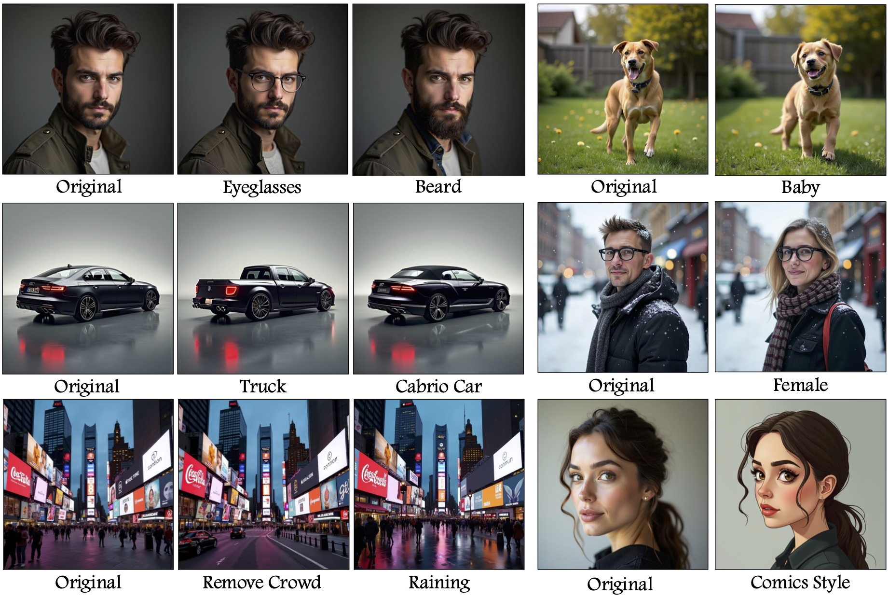

# FluxSpace: Disentangled Semantic Editing in Rectified Flow Transformers [CVPR 2025]

<a href="https://fluxspace.github.io/"></a>
<a href="https://arxiv.org/abs/2412.09611"></a>

## **NOTE :** This is an unofficial implementation of the paper. Please check out their project page! The link to the official implementation will be available here when the authors upload it!

> <a href="https://fluxspace.github.io/">**FluxSpace: Disentangled Semantic Editing in Rectified Flow Transformers**</a>
>
> Yusuf Dalva, Kavana Venkatesh, Pinar Yanardag 
>
> Abstract: Rectified flow models have emerged as a dominant approach in image generation, showcasing impressive capabilities in high-quality image synthesis. However, despite their effectiveness in visual generation, rectified flow models often struggle with disentangled editing of images. This limitation prevents the ability to perform precise, attribute-specific modifications without affecting unrelated aspects of the image. In this paper, we introduce FluxSpace, a domain-agnostic image editing method leveraging a representation space with the ability to control the semantics of images generated by rectified flow transformers, such as Flux. By leveraging the representations learned by the transformer blocks within the rectified flow models, we propose a set of semantically interpretable representations that enable a wide range of image editing tasks, from fine-grained image editing to artistic creation. This work offers a scalable and effective image editing approach, along with its disentanglement capabilities. 


<p>
      
    <br/>
    A training-free disentangled editing method that is able to perform image editing on different domains such as humans, animals, cars and complex scenes like an image of a street.
</p>

# Examples

## Human


## Car


## Scenery


## Real Edits


### Stable-Diffusion 3.5-Large Human Edits


## Ablations

### Coarse Edits - Comic Style


### Fine Edits - Female


### Threshold - Sunglasses


### Edit Iteraion - Old


# Installation

## Install UV

`wget -qO- https://astral.sh/uv/install.sh | sh` 

[More info here](https://docs.astral.sh/uv/getting-started/installation/#standalone-installer)

## Install Environment and Dependencies

`uv sync`

- You can also run `uv run demo.py` and it will install all the dependencies automatically

### Dependencies

```tree
fluxspace v0.1.0
├── accelerate v1.9.0
│   ├── huggingface-hub v0.33.4
│   │   ├── filelock v3.18.0
│   │   ├── fsspec v2025.7.0
│   │   ├── hf-xet v1.1.5
│   │   ├── packaging v25.0
│   │   ├── pyyaml v6.0.2
│   │   ├── requests v2.32.4
│   │   │   ├── certifi v2025.7.14
│   │   │   ├── charset-normalizer v3.4.2
│   │   │   ├── idna v3.10
│   │   │   └── urllib3 v2.5.0
│   │   ├── tqdm v4.67.1
│   │   └── typing-extensions v4.14.1
│   ├── numpy v2.3.1
│   ├── packaging v25.0
│   ├── psutil v7.0.0
│   ├── pyyaml v6.0.2
│   ├── safetensors v0.5.3
│   └── torch v2.7.1
│       ├── filelock v3.18.0
│       ├── fsspec v2025.7.0
│       ├── jinja2 v3.1.6
│       │   └── markupsafe v3.0.2
│       ├── networkx v3.5
│       ├── nvidia-cublas-cu12 v12.6.4.1
│       ├── nvidia-cuda-cupti-cu12 v12.6.80
│       ├── nvidia-cuda-nvrtc-cu12 v12.6.77
│       ├── nvidia-cuda-runtime-cu12 v12.6.77
│       ├── nvidia-cudnn-cu12 v9.5.1.17
│       │   └── nvidia-cublas-cu12 v12.6.4.1
│       ├── nvidia-cufft-cu12 v11.3.0.4
│       │   └── nvidia-nvjitlink-cu12 v12.6.85
│       ├── nvidia-cufile-cu12 v1.11.1.6
│       ├── nvidia-curand-cu12 v10.3.7.77
│       ├── nvidia-cusolver-cu12 v11.7.1.2
│       │   ├── nvidia-cublas-cu12 v12.6.4.1
│       │   ├── nvidia-cusparse-cu12 v12.5.4.2
│       │   │   └── nvidia-nvjitlink-cu12 v12.6.85
│       │   └── nvidia-nvjitlink-cu12 v12.6.85
│       ├── nvidia-cusparse-cu12 v12.5.4.2 (*)
│       ├── nvidia-cusparselt-cu12 v0.6.3
│       ├── nvidia-nccl-cu12 v2.26.2
│       ├── nvidia-nvjitlink-cu12 v12.6.85
│       ├── nvidia-nvtx-cu12 v12.6.77
│       ├── sympy v1.14.0
│       │   └── mpmath v1.3.0
│       ├── triton v3.3.1
│       │   └── setuptools v80.9.0
│       └── typing-extensions v4.14.1
├── diffusers v0.34.0
│   ├── filelock v3.18.0
│   ├── huggingface-hub v0.33.4 (*)
│   ├── importlib-metadata v8.7.0
│   │   └── zipp v3.23.0
│   ├── numpy v2.3.1
│   ├── pillow v11.3.0
│   ├── regex v2024.11.6
│   ├── requests v2.32.4 (*)
│   └── safetensors v0.5.3
├── gradio v5.38.0
│   ├── aiofiles v24.1.0
│   ├── anyio v4.9.0
│   │   ├── idna v3.10
│   │   ├── sniffio v1.3.1
│   │   └── typing-extensions v4.14.1
│   ├── brotli v1.1.0
│   ├── fastapi v0.116.1
│   │   ├── pydantic v2.11.7
│   │   │   ├── annotated-types v0.7.0
│   │   │   ├── pydantic-core v2.33.2
│   │   │   │   └── typing-extensions v4.14.1
│   │   │   ├── typing-extensions v4.14.1
│   │   │   └── typing-inspection v0.4.1
│   │   │       └── typing-extensions v4.14.1
│   │   ├── starlette v0.47.2
│   │   │   ├── anyio v4.9.0 (*)
│   │   │   └── typing-extensions v4.14.1
│   │   └── typing-extensions v4.14.1
│   ├── ffmpy v0.6.0
│   ├── gradio-client v1.11.0
│   │   ├── fsspec v2025.7.0
│   │   ├── httpx v0.28.1
│   │   │   ├── anyio v4.9.0 (*)
│   │   │   ├── certifi v2025.7.14
│   │   │   ├── httpcore v1.0.9
│   │   │   │   ├── certifi v2025.7.14
│   │   │   │   └── h11 v0.16.0
│   │   │   └── idna v3.10
│   │   ├── huggingface-hub v0.33.4 (*)
│   │   ├── packaging v25.0
│   │   ├── typing-extensions v4.14.1
│   │   └── websockets v15.0.1
│   ├── groovy v0.1.2
│   ├── httpx v0.28.1 (*)
│   ├── huggingface-hub v0.33.4 (*)
│   ├── jinja2 v3.1.6 (*)
│   ├── markupsafe v3.0.2
│   ├── numpy v2.3.1
│   ├── orjson v3.11.0
│   ├── packaging v25.0
│   ├── pandas v2.3.1
│   │   ├── numpy v2.3.1
│   │   ├── python-dateutil v2.9.0.post0
│   │   │   └── six v1.17.0
│   │   ├── pytz v2025.2
│   │   └── tzdata v2025.2
│   ├── pillow v11.3.0
│   ├── pydantic v2.11.7 (*)
│   ├── pydub v0.25.1
│   ├── python-multipart v0.0.20
│   ├── pyyaml v6.0.2
│   ├── ruff v0.12.4
│   ├── safehttpx v0.1.6
│   │   └── httpx v0.28.1 (*)
│   ├── semantic-version v2.10.0
│   ├── starlette v0.47.2 (*)
│   ├── tomlkit v0.13.3
│   ├── typer v0.16.0
│   │   ├── click v8.2.1
│   │   ├── rich v14.0.0
│   │   │   ├── markdown-it-py v3.0.0
│   │   │   │   └── mdurl v0.1.2
│   │   │   └── pygments v2.19.2
│   │   ├── shellingham v1.5.4
│   │   └── typing-extensions v4.14.1
│   ├── typing-extensions v4.14.1
│   └── uvicorn v0.35.0
│       ├── click v8.2.1
│       └── h11 v0.16.0
├── matplotlib v3.10.3
│   ├── contourpy v1.3.2
│   │   └── numpy v2.3.1
│   ├── cycler v0.12.1
│   ├── fonttools v4.59.0
│   ├── kiwisolver v1.4.8
│   ├── numpy v2.3.1
│   ├── packaging v25.0
│   ├── pillow v11.3.0
│   ├── pyparsing v3.2.3
│   └── python-dateutil v2.9.0.post0 (*)
├── protobuf v6.31.1
├── sentencepiece v0.2.0
├── torch v2.7.1 (*)
├── torchvision v0.22.1
│   ├── numpy v2.3.1
│   ├── pillow v11.3.0
│   └── torch v2.7.1 (*)
└── transformers v4.53.2
    ├── filelock v3.18.0
    ├── huggingface-hub v0.33.4 (*)
    ├── numpy v2.3.1
    ├── packaging v25.0
    ├── pyyaml v6.0.2
    ├── regex v2024.11.6
    ├── requests v2.32.4 (*)
    ├── safetensors v0.5.3
    ├── tokenizers v0.21.2
    │   └── huggingface-hub v0.33.4 (*)
    └── tqdm v4.67.1
(*) Package tree already displayed
```

### Huggingface Token

[Guide to create Huggingface Access Token to access Gated Repository](https://huggingface.co/docs/hub/en/security-tokens)

# Usage

## Gradio Demo

`uv run demo.py`

Note : While the demo can perform real image editing for FLUX.1-dev, the image is not perfectly inverted to the latent distribution of the model and is therefore recommended to use the text option as you will see better results on editing with images generated by FLUX.1-dev

## Scripts

- Coarse Edit: `bash scripts/coarse.sh`
- Fine Edit: `bash scripts/fine.sh`
- Both: `bash scripts/both.sh`
- Grids: `bash scripts/grid.sh`

# Acknowledgements

I would like to thank the contributors of [diffusers](https://github.com/huggingface/diffusers) repository for their open contributions.

# Citation

If you find this useful for your research, please cite the following:

```bibtex
@InProceedings{Dalva_2025_CVPR,
    author    = {Dalva, Yusuf and Venkatesh, Kavana and Yanardag, Pinar},
    title     = {FluxSpace: Disentangled Semantic Editing in Rectified Flow Models},
    booktitle = {Proceedings of the Computer Vision and Pattern Recognition Conference (CVPR)},
    month     = {June},
    year      = {2025},
    pages     = {13083-13092}
}
```